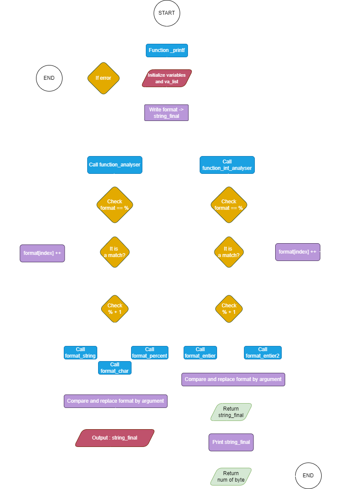

# Printf Project 💻

A formatted output conversion C, the program is a pseudo-
recreation of the C standard library function, `printf`.

## Flowchart _printf 🚧


## Requirements ⤵️

The `_printf` function was coded on an Ubuntu 20.04 LTS machine with `gcc`.
Check the betty style !

## Usage 🤝

To use the `_printf` function, assuming the above dependencies have been checked,
compile all `.c` files in the repository and include the header `main.h` with
main function.

Example `main.c`:
```
#include "main.h"

int main(void)
{
    _printf("Hello, Holberton");

    return (0);
}
```

Compilation:
```
$ gcc -Wall -Werror -Wextra -pedantic -std=gnu89 -Wno-format *.c
```

Output:
```
$ ./a.out
Hello, Holberton
$
```

## Description 🚀

Our group project is a customized version of the printf function in C programming. 
It's a tool that helps format and display text based on specific formatting instructions. 
It supports formats for characters, strings of text, and integers, allowing for flexible text outputs in C programming.

Prototype: `int _printf(const char *format, ...);`

### Return Value

Upon successful return, `_printf` returns the number of characters printed
(excluding the terminating null byte used to end output to strings). If an
output error is encountered, the function `exit (1)`.

### Format of the Argument String

The `format` string argument is a character string composed of directives: 
ordinary characters (not `%`) which are copied unchanged
to the output ; and conversion specifications. 
Conversion specification is introduced by the character `%` and ends with a conversion specifier. In
between the `%` character and conversion specifier.The arguments must correspond
with the conversion specifier, and are used in the order given.

#### Conversion Specifiers 🔄

The conversion specifier (introduced by the character `%`) is a character that
specifies the type of conversion to be applied. The `_printf` function
supports the following conversion specifiers:

#### Specifiers d, i :
The `int` argument is converted to signed decimal notation.

Example `main.c`:
```
int main(void)
{
    _printf("%d\n", 7);
}
```
Output:
```
7
```

#### Specifier c :
The `char` argument.

Example `main.c`:
```
int main(void)
{
    _printf("%c\n", A);
}
```
Output:
```
A
```

#### Specifier s : 
The `char *` argument is expected to be a pointer to a character array. 
Characters from the array are written starting from the first element of the array and ending at, 
but not including, the terminating null byte (`\0`).

Example `main.c`:
```
int main(void)
{
    _printf("%s\n", "Hello, Holberton School!");
}
```
Output:
```
Hello, Holberton School!
```

#### Specifier % :
A `%` is written. After the conversion specification is `%%`.

Example:
```
int main(void)
{
    _printf("%%\n");
}
```
Output:
```
%
```
## Authors 🧞‍♂️🧞‍♀️
[Link to the collaborators of this beautiful project](AUTHORS.md)

